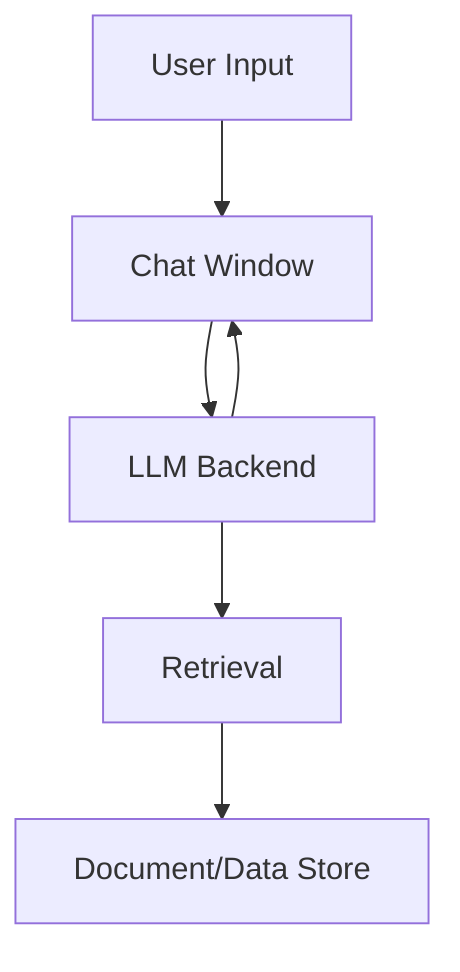

# Architecture: Local AI Chatbot POC

## Overview
This document describes the architecture, components, and deployment strategies for the Local AI Chatbot POC. The design is inspired by the structure and best practices of the agentic-mortgage-research project.

## System Components
- **UI:** Streamlit-based chat interface (`ui/app.py`) with modern, right-aligned, bottom-aligned chat bubbles, LLM/model display, and feedback controls
- **LLM Integration:** Supports HuggingFace models and local Ollama (llama2:7b-chat, mistral, etc.)
- **Retrieval:** FAISS vector search with SentenceTransformers embeddings
- **Data:** CSV and local file-based document storage
- **Feedback & Logging:** Thumbs up/down voting, semantic similarity metrics, response time, LLM name display, and CSV logging (demo_results.csv)

## Key Design Principles
- Modular, extensible codebase
- Reproducible environments (requirements.txt, devcontainer)
- Secure secrets/configuration management (.env, .streamlit/secrets.toml)
- GitHub Actions for uptime and CI/CD
- Documentation-first: README, CHANGELOG, and architecture docs

## Deployment
- **Streamlit Cloud:** HuggingFace models only
- **Self-hosted/VM:** Full feature set with Ollama support
- **Dev Container:** VS Code + Docker for reproducible local development

## Recent Updates (v0.6.0)
- Unified chat UI in `ui/app.py` (basic_chat.py deprecated)
- Always display LLM/model name after each response
- Improved retrieval accuracy and logging
- Feedback and improvements tracker in sidebar
- Removal of unused `my_chat_component` folder

## Diagrams
### Chat UI and Data Flow (Mermaid)

## Further Reading
- See README.md for quick start and usage
- See CHANGELOG.md for release history
