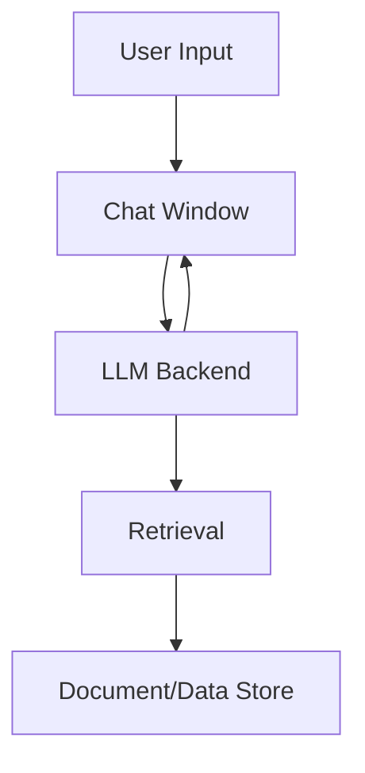

# Architecture: Local AI Chatbot POC

## Overview
This document describes the architecture, components, and deployment strategies for the Local AI Chatbot POC. The design is inspired by the structure and best practices of the agentic-mortgage-research project.

## System Components
- **UI:** Streamlit-based chat interface (`ui/app.py`) with modern, right-aligned, bottom-aligned chat bubbles, persistent LLM/model display, and feedback controls
- **Sidebar:** About, Project Documentation, Tech Stack, System Design Notes, App Version (all styled and mobile-friendly)
- **LLM Integration:** Supports HuggingFace models and local Ollama (llama2:7b-chat, mistral, etc.), switchable via UI
- **Retrieval:** FAISS vector search with SentenceTransformers embeddings
- **Data:** CSV and local file-based document storage
- **Feedback & Logging:** Thumbs up/down voting, semantic similarity metrics, response time, LLM name display, and CSV logging (demo_results.csv)

## Key Design Principles
- Modular, extensible codebase
- Reproducible environments (requirements.txt, devcontainer)
- Secure secrets/configuration management (.env, .streamlit/secrets.toml)
- GitHub Actions for uptime and CI/CD
- Documentation-first: README, CHANGELOG, and architecture docs

## Deployment
- **Streamlit Cloud:** HuggingFace models only
- **Self-hosted/VM:** Full feature set with Ollama support
- **Dev Container:** VS Code + Docker for reproducible local development

## Recent Updates (v0.9.0)
- Unified, modern chat UI with colored header, sidebar, and persistent model display
- Sidebar: About, Project Documentation, Tech Stack, System Design Notes, App Version
- Conversational Q&A over internal documents (PDF, DOCX, TXT)
- Semantic search and retrieval with FAISS and SentenceTransformers
- LLM support: Ollama (local) and HuggingFace Transformers (cloud/local)
- Feedback logging, semantic similarity, and response time metrics
- CSV logging of all interactions for evaluation
- Modular, extensible Python codebase

## Diagrams
### Chat UI and Data Flow (Mermaid)

## Further Reading
- See README.md for quick start and usage
- See CHANGELOG.md for release history
