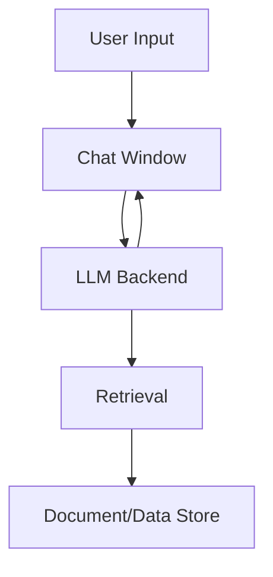

## 🖼️ System Diagram

> **Version:** v0.8.0 — February 21, 2026



# 🧠 Local AI Chatbot POC

A hands-on AI project demonstrating semantic search, LLM chat, and feedback logging with a modern, production-ready Python/Streamlit stack. Inspired by the structure and best practices of [agentic-mortgage-research](https://github.com/obizues/agentic-mortgage-research).

## 🚀 Quick Start

### Prerequisites
- Python 3.10+
- (Optional) Ollama installed for local LLM support

### Setup
1. Clone the repo:
   ```
   git clone https://github.com/obizues/Local-AI-Chatbot-POC.git
   cd Local-AI-Chatbot-POC
   ```
2. Install dependencies:
   ```
   pip install -r requirements.txt
   ```
3. (Optional) Configure secrets:
   - Copy `.env.example` to `.env` and set any required keys
   - Or copy `.streamlit/secrets.toml.example` to `.streamlit/secrets.toml`
4. Run the app:
   ```
   streamlit run ui/app.py
   ```

   (The new modern chat UI is integrated directly in ui/app.py. No need to use basic_chat.py. The `my_chat_component` folder has been removed as of v0.6.0.)


## 🛠️ Features (v0.8.0)
* Modern, compact Streamlit chat UI with colored header, sidebar sections, and centered user info
* Sidebar: About, Documentation, Tech Stack, System Design Notes, App Version
* Unified chat logic in `ui/app.py` (no more `basic_chat.py`)
* Always display LLM/model name after each response
* Robust FAISS index and metadata loading
* Semantic search and retrieval with SentenceTransformers
* Feedback logging, semantic similarity, response time metrics
* CSV logging of all interactions
* Devcontainer and GitHub Actions for reproducible development
- Modern Streamlit chat UI with right-aligned chat bubbles and bottom-aligned messages
- LLM/model name always displayed after each response
- LLM support (Ollama and HuggingFace)
- Semantic search and retrieval with FAISS and SentenceTransformers
- Thumbs up/down feedback with logging
- Semantic similarity and elapsed time metrics
- CSV logging of all interactions (including LLM name and response time)
- Improvements tracker in sidebar
- Devcontainer and GitHub Actions for reproducible development and uptime

## 📦 Project Structure (as of v0.8.0)
- `ui/app.py` — Main Streamlit app (contains the new chat UI)
- `llm_backend/` — LLM and RAG pipeline code
- `ingestion/` — Data ingestion and chunking scripts
- `vector_db/` — FAISS index and metadata
- `mock_data/` — Example documents
- `.devcontainer/` — VS Code devcontainer config
- `.github/workflows/` — GitHub Actions workflows
- `.streamlit/` — Streamlit secrets example
- `.env.example` — Example environment variables
- `ARCHITECTURE.md` — System architecture and design
- `CHANGELOG.md` — Release history

*Note: The `my_chat_component` folder has been removed as of v0.6.0. All chat UI is now in `ui/app.py` as of v0.8.0.*

## 🔐 Security Notes
- No API keys are committed
- Use `.env` or `.streamlit/secrets.toml` for secrets
- All secrets files are gitignored

## 📚 Further Reading
- [ARCHITECTURE.md](ARCHITECTURE.md)
- [CHANGELOG.md](CHANGELOG.md)
- [System Design Notes](ARCHITECTURE.md#system-components)

## 📝 License
MIT License — see [LICENSE]
